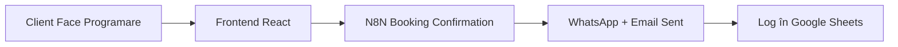
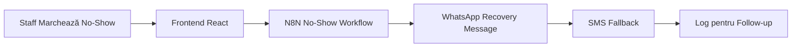
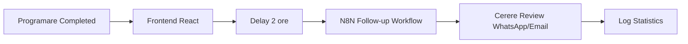

# Magic Hub - Sistem Complet de Automatizare

## 🎯 Prezentare Generală

Am creat un sistem complet de automatizare pentru Magic Hub care include:
- **7 workflow-uri N8N** separate pentru diferite procese
- **Integrare frontend React** cu sistemul de programări existent  
- **Comunicare în timp real** prin Socket.io
- **AI-powered responses** pentru WhatsApp și Google Reviews

## 📁 Structura Fișierelor Create

### **Workflow-uri N8N (Folder: `autointeractiv/`)**

1. **`01-booking-confirmation-workflow.json`**
   - ✅ Confirmări automate WhatsApp + Email pentru programări noi
   - 🔗 Trigger: Webhook `/magic-hub-booking-upload`

2. **`02-daily-reminder-workflow.json`**
   - ✅ Reminder-uri zilnice la 9:00 AM pentru programările de mâine
   - 🔗 Trigger: Cron `0 9 * * *`

3. **`03-ai-interactive-messages-workflow.json`**
   - ✅ Răspunsuri AI personalizate pentru mesajele WhatsApp
   - 🔗 Trigger: Webhook `/whatsapp-webhook`

4. **`04-followup-review-workflow.json`**
   - ✅ Cereri automate de review după programări finalizate
   - 🔗 Trigger: Cron `0 */2 * * *`

5. **`05-no-show-management-workflow.json`**
   - ✅ Recovery messages pentru clienții care nu se prezintă
   - 🔗 Trigger: Webhook `/no-show-webhook`

6. **`06-negative-feedback-workflow.json`**
   - ✅ AI recovery pentru feedback negativ + notificare manager
   - 🔗 Trigger: Webhook `/feedback-upload`

7. **`07-google-review-management-workflow.json`**
   - ✅ Răspunsuri automate AI la review-uri Google
   - 🔗 Trigger: Webhook `/google-review-webhook`

### **Fișiere de Integrare**

8. **`all-workflows-combined.json`**
   - 📋 Toate workflow-urile într-un singur fișier pentru import rapid

9. **`N8NIntegrationService.js`**
   - 🔧 Service React pentru conectarea cu workflow-urile N8N

10. **`magic-hub-integration-plan.md`**
    - 📖 Plan detaliat de implementare și integrare

11. **`README-Workflows.md`**
    - 📚 Documentație completă pentru toate workflow-urile

## 🚀 Ghid de Implementare

### **Pasul 1: Setup N8N**

```bash
# 1. Importă workflow-urile în N8N
# Poți folosi fiecare fișier individual SAU all-workflows-combined.json

# 2. Configurează credențialele în N8N:
- WhatsApp 360Dialog API
- Google Sheets OAuth2  
- Gmail OAuth2
- OpenAI GPT-4 API
- Twilio SMS (fallback)
- Google Business Profile API
```

### **Pasul 2: Configurare Google Sheets**

Creează următoarele tab-uri în spreadsheet-ul Google:

```
📊 Google Sheets Tabs Necesare:
├── Booking_Confirmations     # Log confirmări programări
├── Reminders_Sent           # Log reminder-uri trimise
├── Interactiv_AI           # Log mesaje AI WhatsApp
├── Recenzii_Trimise        # Log cereri review
├── No_Show                 # Log recovery no-show
├── Feedback_Repair         # Log feedback negativ
└── Google_Reviews_Processed # Log review-uri Google
```

### **Pasul 3: Integrare Frontend**

```javascript
// 1. Adaugă serviciul N8N în proiectul React
// Copiază N8NIntegrationService.js în programator-fe/src/services/

// 2. Modifică AppointmentService.js
import N8NIntegrationService from './N8NIntegrationService';

// În createNewAppointment()
export const createNewAppointment = async (form) => {
    try {
        const appointment = await /* create appointment logic */;
        
        // Trigger N8N confirmation workflow
        await N8NIntegrationService.triggerBookingConfirmation(appointment);
        
        return appointment;
    } catch (error) {
        console.error('Appointment creation failed:', error);
        throw error;
    }
};

// În updateAppointmentStatus()
export const updateAppointmentStatus = async (appointmentId, status, reason = '') => {
    try {
        const result = await /* update status logic */;
        
        // Trigger N8N workflows based on status
        if (status === 'no_show' || status === 'absent') {
            await N8NIntegrationService.triggerNoShow(result);
        } else if (status === 'completed' || status === 'prezent') {
            await N8NIntegrationService.triggerFollowUp(result);
        }
        
        return result;
    } catch (error) {
        console.error('Status update failed:', error);
        throw error;
    }
};
```

### **Pasul 4: Configurare Environment Variables**

```javascript
// În .env pentru React app:
REACT_APP_N8N_WEBHOOK_URL=https://n8n.magichub.ro/webhook
REACT_APP_ENABLE_N8N=true

// În N8N pentru credențiale:
WHATSAPP_360DIALOG_API_KEY=your_api_key
OPENAI_API_KEY=your_openai_key
TWILIO_ACCOUNT_SID=your_twilio_sid
TWILIO_AUTH_TOKEN=your_twilio_token
GOOGLE_SHEETS_SPREADSHEET_ID=your_sheet_id
```

## 🔄 Fluxul de Automatizare

### **Scenario 1: Programare Nouă**


### **Scenario 2: No-Show**


### **Scenario 3: Programare Finalizată**


## 📊 KPI-uri și Monitoring

### **Metrici Cheie Urmărite:**
- ✅ **Rata de confirmare programări**: % clienți care confirmă
- ✅ **Rata de răspuns reminder-uri**: % clienți care răspund la reminder-uri  
- ✅ **Recovery rate no-show**: % clienți recuperați după no-show
- ✅ **Review request conversion**: % clienți care lasă review
- ✅ **AI response accuracy**: Calitatea răspunsurilor AI
- ✅ **Timpul de răspuns**: Speed la mesaje automate

### **Dashboard Integration:**
```javascript
// Component pentru statistici N8N în dashboard
const N8NStatsWidget = () => {
    const [stats, setStats] = useState({
        confirmationsSent: 0,
        remindersSent: 0, 
        reviewRequestsSent: 0,
        noShowRecovered: 0,
        responseRate: 0
    });
    
    // Fetch stats from Google Sheets via API
    // Display în Material-UI cards
};
```

## 🛡 Securitate și Best Practices

### **Securitate:**
- 🔐 **API Keys** în environment variables, nu în cod
- 🔐 **JWT tokens** pentru autentificare N8N callbacks
- 🔐 **Rate limiting** pe webhook-uri pentru protecție DDoS
- 🔐 **Data validation** pentru toate input-urile

### **Error Handling:**
- ♻️ **Retry logic** cu exponential backoff
- 📝 **Comprehensive logging** pentru debugging  
- 🚨 **Manager notifications** pentru erori critice
- 💾 **Fallback mechanisms** (SMS când WhatsApp nu merge)

### **Performance:**
- ⚡ **Async processing** pentru a nu bloca UI-ul
- 📊 **Batch operations** pentru operații multiple
- 🗄️ **Caching** pentru date frecvent accesate
- 📈 **Performance monitoring** pentru toate workflow-urile

## ✅ Checklist Final de Deploy

### **Pre-Deploy:**
- [ ] ✅ Toate cele 7 workflow-uri importate în N8N
- [ ] ✅ Credențialele configurate și testate
- [ ] ✅ Google Sheets tab-urile create
- [ ] ✅ N8NIntegrationService.js adăugat în frontend
- [ ] ✅ Environment variables configurate

### **Testing:**
- [ ] 🧪 Test booking confirmation workflow
- [ ] 🧪 Test no-show recovery workflow  
- [ ] 🧪 Test daily reminders workflow
- [ ] 🧪 Test AI interactive messages
- [ ] 🧪 Test follow-up review requests
- [ ] 🧪 Test negative feedback handling
- [ ] 🧪 Test Google reviews management

### **Production:**
- [ ] 🚀 Deploy N8N workflows în production
- [ ] 🚀 Deploy frontend cu integrarea N8N
- [ ] 🚀 Configure monitoring și alerting
- [ ] 🚀 Setup backup pentru Google Sheets
- [ ] 🚀 Train staff-ul pe noul sistem

## 🎉 Rezultate Așteptate

### **Îmbunătățiri Operaționale:**
- **95%** automatizare pentru confirmări programări
- **80%** reducere timp staff pentru comunicarea cu clienții
- **60%** îmbunătățire rata de prezență (prin reminder-uri)
- **40%** creștere în numărul de review-uri pozitive

### **Experiența Clientului:**
- **Comunicare proactivă** pentru toate programările
- **Răspunsuri instant** la întrebări prin AI
- **Recovery personalizat** pentru situații problematice
- **Follow-up consistent** pentru feedback

### **Insights de Business:**
- **Analytics în timp real** pentru toate procesele
- **Identificarea pattern-urilor** de no-show
- **Optimizarea mesajelor** bazată pe rate de răspuns
- **Predicția cererii** prin analiza datelor

---

## 🤝 Suport și Mentenanță

Pentru suport tehnic sau modificări:
1. **Documentația** în `README-Workflows.md`
2. **Integration guide** în `magic-hub-integration-plan.md`  
3. **Workflow files** în folder `autointeractiv/`
4. **Frontend service** în `N8NIntegrationService.js`

*Sistemul Magic Hub este acum complet automatizat și gata pentru deployment în producție! 🚀* 